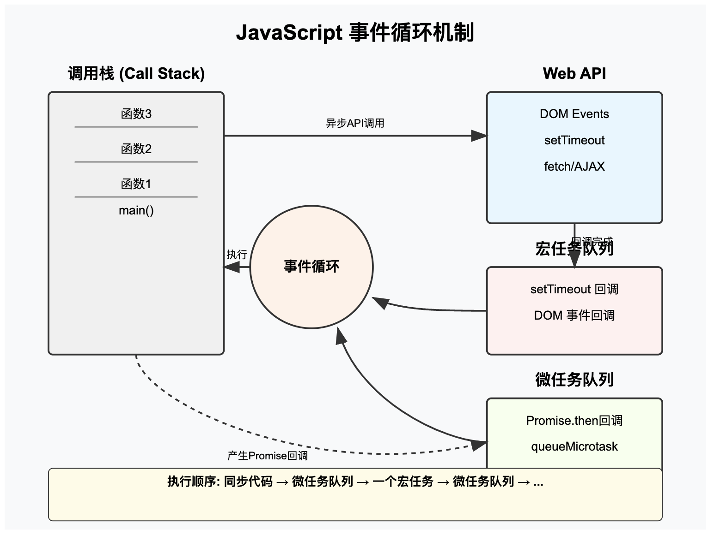

## Javascript 如何实现异步编程，可以详细描述 `EventLoop` 机制

> Reference: [MDN: The event loop](https://developer.mozilla.org/en-US/docs/Web/Javascript/Event_loop), [What is an event loop in Javascript ?](https://www.geeksforgeeks.org/what-is-an-event-loop-in-javascript/)

>

Javascript 是一种单线程语言，这意味着它一次只能执行一个任务。为了处理耗时的任务而不阻塞主进程，Javascript 提供了异步编程的能力。异步编程允许代码在等待异步操作（如 I/O、网络请求等）完成的同时，继续执行后续任务。Javascript 实现异步编程的主要机制包括回调函数、Promises、async/await 以及事件循环（Event Loop）

### 异步编程的方法

- 回调函数（Callbacks）

  回调函数是最早期的异步编程方法，通过将函数作为参数传递给另一个函数，然后在异步操作完成时执行这个回调函数。但其的缺点为可能会导致回调地狱（Callback Hell），使代码难以阅读和维护

- Promise

  为了解决回调地狱的问题，Promise 被引入，Promise 是一个代表异步操作最终完成或失败的对象。其提供 `.then()` 和 `.catch()` 方法来分别处理成功和失败的情况。Promise 的出现也使得异步代码更加易于组织和理解

- Async/Await

  基于 Promise 的语法糖，使异步代码看起来更像同步代码，`async` 关键字用于声明一个异步函数，`await` 关键字用于等待一个异步操作的结果。`async/await` 提高了代码的可读性和编写的简洁性

### 事件循环（Event Loop）

JavaScript 的事件循环（Event Loop）是 JavaScript 运行时环境的一个核心机制，负责执行代码、收集和处理事件以及执行队列中的子任务。以下是对事件循环机制的详细解释：

#### 事件循环的基本组成部分

1. **调用栈（Call Stack）**：

   - 用于存储正在执行的函数和等待完成的函数
   - 遵循"后进先出"（LIFO）的原则
   - JavaScript 是单线程的，一次只能执行一个任务

2. **任务队列（Task Queue/Callback Queue）**：

   - 宏任务（Macrotasks）队列：存储 setTimeout、setInterval、I/O 操作等回调函数
   - 微任务（Microtasks）队列：存储 Promise 的 then/catch/finally 回调、queueMicrotask()等

3. **Web API**：

   - 由浏览器提供的 API（如 DOM、XMLHttpRequest、setTimeout 等）
   - Node.js 中则有相应的 C++ 实现

#### 事件循环的工作流程

1. 执行同步代码，这些代码会被推入调用栈并立即执行
2. 当调用栈为空时，检查微任务队列，执行所有微任务
3. 执行一个宏任务（如果有的话）
4. 再次检查微任务队列，执行所有微任务
5. 重复步骤 3 和 4，形成循环

#### 宏任务和微任务

**宏任务（Macrotask）**：

- setTimeout/setInterval 回调
- script 整体代码
- I/O 操作
- UI 渲染
- setImmediate（Node.js 环境）

**微任务（Microtask）**：

- Promise 的 then/catch/finally 回调
- process.nextTick（Node.js 环境）
- queueMicrotask()
- MutationObserver 回调

**执行优先级**：微任务总是在当前宏任务执行完成后、下一个宏任务开始前执行完毕。

#### 流程图



#### 面试示例代码讲解

```javascript
console.log("1"); // 同步代码

setTimeout(() => {
  console.log("2"); // 宏任务
}, 0);

Promise.resolve().then(() => {
  console.log("3"); // 微任务
});

console.log("4"); // 同步代码
```

**执行顺序解析**：

1. 打印 '1'（同步代码）
2. 将 setTimeout 回调放入宏任务队列
3. 将 Promise.then 回调放入微任务队列
4. 打印 '4'（同步代码）
5. 同步代码执行完毕，检查微任务队列并执行，打印 '3'
6. 微任务队列清空，执行下一个宏任务，打印 '2'

**输出结果**：1 4 3 2

#### 面试中常见问题

1. **为什么需要区分宏任务和微任务？**

   - 这种机制保证了特定任务的执行优先级，使得某些操作（如 Promise 回调）能够尽快得到处理

2. **Node.js 和浏览器环境下事件循环的区别？**

   - Node.js 的事件循环基于 libuv，有不同的阶段
   - 老版本 Node.js 中 process.nextTick 优先级高于 Promise.then
   - 新版本（11+）的 Node.js 已经和浏览器行为趋于一致

3. **如何避免事件循环阻塞？**

   - 避免长时间执行的同步操作
   - 将复杂计算拆分成小任务
   - 使用 Web Workers 处理耗时操作
